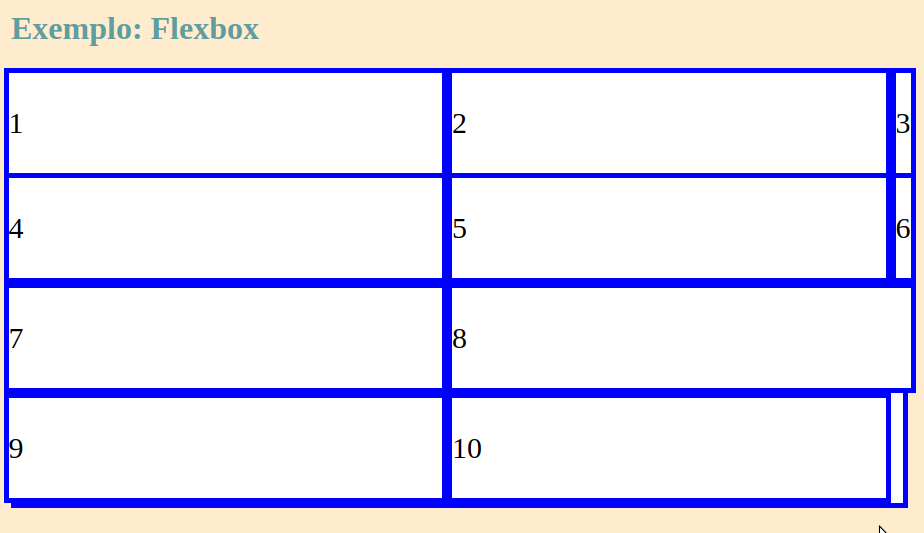

<h1>CSS Basics</h1>

Repositório destinado ao estudo de conceitos básicos da 
    linguagem CSS. O conteúdo do repositório foi gerado a partir 
    de curso online.

<h3>Arquivos do repositório</h3>

<ul>
    <li><b>flexbox: </b> arquivos com extensão .css cujos códigos apresentam 
    os módulos de layout do flexbox.</li>
    <li><b>grid: </b> arquivos com extensão .css cujos códigos apresentam 
        os módulos de layout do grid.</li>
    <li><b>Bootstrap:</b>arquivos com extensão .css para treino e verificação de 
    códigos com base nessa biblioteca baseada em flexbox e grid.</li>
</ul>

O arquivo index.html serve para importar os arquivos das pastas 
    citadas acima e assim tornar possível a visualização dos testes 
    realizados.

Exemplo do que pode ser testado...

<h3>Alguns links úteis...</h3>

<a href="https://www.w3schools.com/css/css3_flexbox.asp">https://www.w3schools.com/css/css3_flexbox.asp</a>

<a href="https://uigradients.com/#Telegram">https://uigradients.com/#Telegram</a>

<a href="https://getbootstrap.com/docs/4.0/examples/">https://getbootstrap.com/docs/4.0/examples/</a>

<a href="https://www.w3schools.com/css/css_grid.asp">https://www.w3schools.com/css/css_grid.asp</a>

<a href="https://htmlcolorcodes.com/">https://htmlcolorcodes.com/</a>
